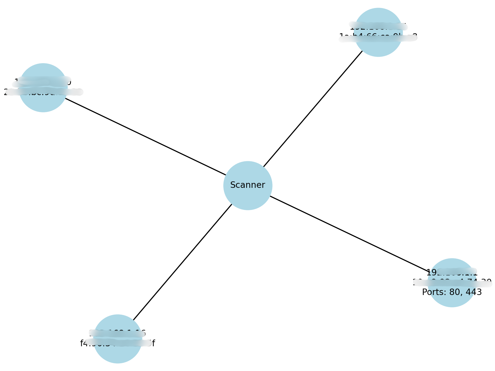

# NetScan

Ce projet est un scanner réseau développé en Python.  
Il permet de détecter les hôtes actifs sur un réseau local, de scanner certains ports ouverts (80 et 443),  
puis de générer une carte réseau visuelle montrant les appareils détectés et leurs ports ouverts.

---

## Fonctionnalités

- Scan ARP pour découvrir les hôtes du réseau local
- Scan des ports 80 et 443 pour chaque hôte détecté
- Sauvegarde des résultats dans un fichier JSON (`output/results.json`)
- Génération d’une carte réseau graphique (`output/network.png`) affichant les appareils et leurs ports ouverts

---

## Prérequis

- Python 3.x
- Modules Python : `scapy`, `networkx`, `matplotlib`

Installation rapide des dépendances :

```bash
pip install -r requirements.txt
```
--- 

## Utilisation

Lancer le script principal :

```bash
python scanner.py
```
---

## Résultat

Le script génère une carte réseau graphique `output/network.png` illustrant les hôtes détectés ainsi que leurs ports ouverts.

  


##### Note importante :
Pour des raisons de confidentialité et de sécurité, cette image est floutée dans ce dépôt GitHub.  
En effet, elle contient des informations sensibles telles que les adresses IP, adresses MAC et ports ouverts de votre réseau local.  
Partager ces données publiquement pourrait exposer la topologie et les failles potentielles de votre réseau.

Si vous souhaitez voir un aperçu, il est recommandé de lancer le script localement dans un environnement sécurisé.


---

## Auteur

[Arno TEIXEIRA](https://github.com/arnoteix/)


